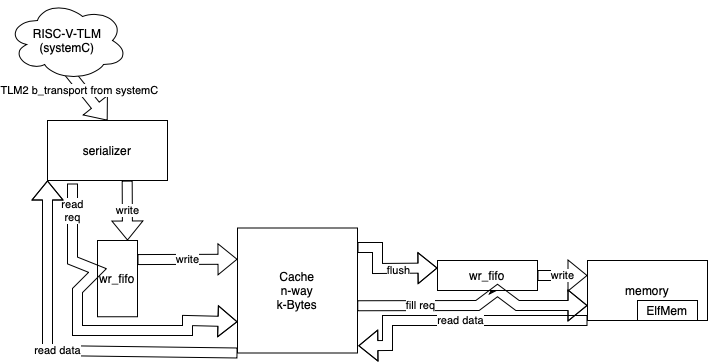
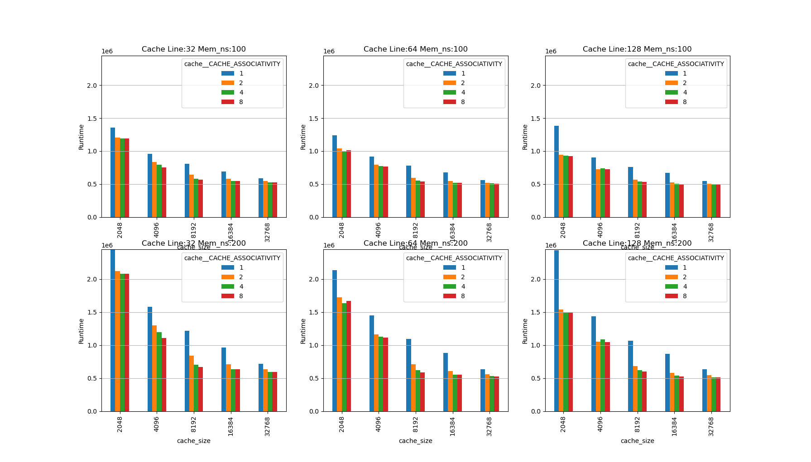
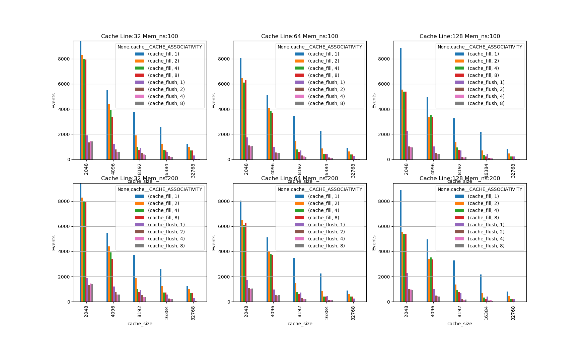

# RISCV Cache testcase
This is a simple test case, forked from an opensource RISC-V-TLM simulator (closer to an ISS than a functional sim).  I replaces the Memory with my own Python implimentation to explore cache sizes and parameters.

This is a toy example to show/test the capabilities of ```pysc```.  The RISC-V-TLM memory block services the I-stream and DATA, which hurts perfomrance.  It also does unaligned memory transactions, no dedicated I-cache, no pre-fetching, ....

The goal of this test is not to find the best cache paramaters, but to show that high level architecture PPA can be performed using python with open-source tools in a reasonable amount of time.

## Components
* RISC-V-TLM - Forked project.  There are some small edits to link in the Python code to Memory.cpp and some edits to Simulator.cpp to update the top level functionality that Python takes over.
    * see RISC-V-TLM/README.md
    * pysc replaces 'Memory' with a module defined in PyRiscv.Memory (which has sub-components)
* *.py - Python code
    * cache.py - Impliments to cache part of the memory system. LRU, write-back, write-allocate (sweepable number of ways and size)
    * ElfMem.py - ELF file reader, to read in the binary file and module the backing memory (not sparse)
    * mem_types.py - data types for read/write transactions
    * memory.py - the model for the backing memory (includes ElfMem.py)
    * params.py - Holds globals for configureing the componets and saving simulation stats
    * PyRiscv.py - Top level pythone file, sweeps the params, runs the sim, builds the Memory type
    * report.py - a pandas script to read the output from simulation and create some pivot charts for PPA
    * serializer.py - converts the tlm_generic_payload and TLM2 calls to interanal protocal (and maintain order)
    * thread_utils.py - helper classes for managing threading
    * Utils.py - more helper classes for managing running in pysc (loging, debug, trace, ...)
    * write_fifo.py - impliments the write merge buffer and a write buffer

## Structure of 'Memory'
I wanted to explore PPA for different cache trade-offs: cache line size, cache size, cache associativity, memory performance.


## Running
* build the systemc code:
```make sim.so```
* running
```python3 PyRiscv.py```
* reporting results
```python3 report.py --src foo.sqlite```
* manuals results extraction
```
sqlite3 foo.sqlite
.headers on
SELECT * FROM perf;
```
* debug
```gtkwaves trace.vcd```

## Sweepable parameters
* write_fifo
    * SIZE - number of entries in the fifo
    * READ_NS - time to read through the fifo
    * WRITE_NS - time to write to the fifo
* cache
    * CACHE_ENTRIES - number of cache lines in total
    * CACHE_ASSOCIATIVITY - number of ways for set in the cache
    * CACHE_READ_NS - time to read from the cache
    * CACHE_WRITE_NS - time to write to the cache
* memory
    * MEM_NS - memory access time
* _global_
    * CACHE_WORD - size of a cache line in Bytes

### Example
From PyRiscv.py
```
if __name__ == "__main__":
    print("Python starting")
    print = sc_print
    for cache_ws in [32,64,128]:
        for mem_ns in [100,200]:
            for cache_size in [2,4,8,16,32]:
                for assciativity in [1,2,4,8]:
                    params.params_cache.CACHE_ENTRIES = cache_size*1024//cache_ws
                    params.params_cache.CACHE_ASSOCIATIVITY = assciativity
                    params.params_mem.MEM_NS = mem_ns
                    params.CACHE_WORD = cache_ws

                    if params.params_cache.CACHE_ENTRIES<params.params_cache.CACHE_ASSOCIATIVITY:
                        next

                    perf = Perf(cache_ws=params.CACHE_WORD)

                    params.recored_params(perf)
                    run_stats = perf
                    sim.start(["-L 3","RISC-V-TLM/tests/C/dhrystone/dhrystone.hex"])
        
                    perf.runtime = pysc.cur_time().ns
                    session.add(perf)
                    session.commit()

                    sim.restart()
```

## Results from report.py
The toy test case runs the ```dhrystone``` test case from the orgional branch (limiting the loop count).  The following plots come stright from the report.py tool (using pandas and matplotlib).

### Performance
Performance is fairly stright forward to observe, the top 3 plots show runtime for backing memory of 100ns access time (not normalized for word size). And the bottom plots show runtime for 200ns memory.  The left column is for a cache line of 32Bytes, center 64Bytes, and right column for 128Bytes.  Total cache size is on the x-axis and the different bars show number of ways in the cache.


### Power
Power analysis lacks physical data, but can provide inputs to a spread sheet analysis based on events (fill and flush).  Other events can be added to the database as well.


